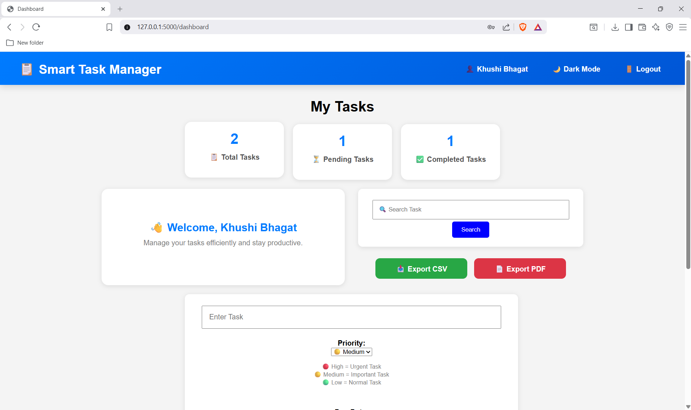
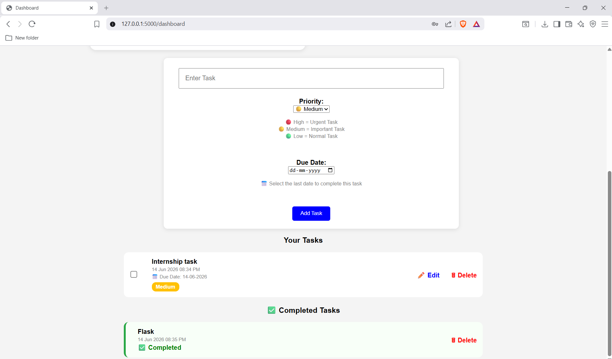

# Smart Task Manager

## Overview

Smart Task Manager is a Flask-based web application that helps users manage their daily tasks efficiently. Users can create, update, delete, search, and track tasks with priority levels and due dates. The application also provides task statistics, dark mode support, and task export functionality.

---

## Features

- User Registration and Login
- Secure Session Management
- Add, Edit, and Delete Tasks
- Mark Tasks as Completed
- Task Priority Management (High, Medium, Low)
- Due Date Tracking
- Search Tasks
- Task Statistics Dashboard
- User Profile Page
- Dark Mode Toggle
- Export Tasks to CSV
- Export Tasks to PDF

---

## Technologies Used

- Python
- Flask
- SQLite
- HTML5
- CSS3
- JavaScript
- ReportLab (for PDF Export)

---

## How to Run

1. Clone the repository:
```bash
git clone <repository-link>
```

2. Install dependencies:
```bash
pip install flask reportlab
```

3. Run the application:
```bash
python app.py
```

4. Open in browser:
```text
http://127.0.0.1:5000
```

---

## Output

```text
- Registration Page
- Login Page
- Dashboard with Task Statistics
- Task Management Interface
- User Profile Page
- CSV and PDF Export Functionality
- Dark Mode Dashboard
```

### Dashboard




---

## Future Enhancements

- Email Verification
- Password Reset Feature
- Task Categories and Tags
- Notifications and Reminders
- Cloud Database Integration
- Mobile Responsive Design
- Task Sharing and Collaboration

---

## Author

Khushi Bhagat

---
